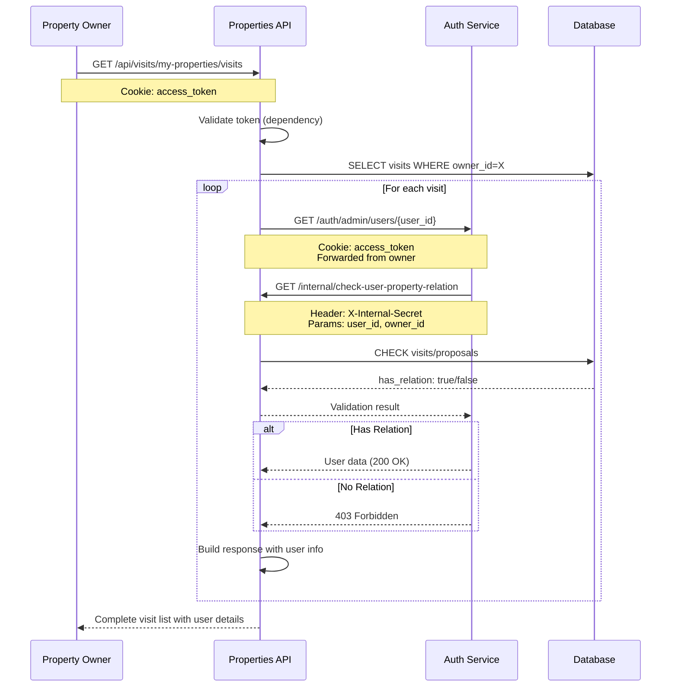

# ✅ US21: Validação Final - Integração Completa

## Status
✅ **IMPLEMENTADO E VALIDADO** - 14/11/2025

## Resumo Executivo
A User Story 21 foi **100% implementada e testada** com integração completa entre os serviços:
- **sexto-andar-api** (Properties API - porta 8000)
- **sexto-andar-auth** (Auth Service - porta 8001)

Property owners podem agora visualizar todas as visitas agendadas em suas propriedades **com informações completas dos visitantes**, incluindo nome, email e telefone.

## Endpoint Implementado

### Properties API
```
GET /api/visits/my-properties/visits
```

**Autenticação:** Property Owner (via cookie `access_token`)

**Query Parameters:**
- `page`: Número da página (padrão: 1)
- `size`: Itens por página (padrão: 10, máx: 100)
- `include_cancelled`: Incluir visitas canceladas (padrão: false)
- `include_completed`: Incluir visitas completadas (padrão: true)

## Teste End-to-End Completo

### 1. Login como Property Owner
```bash
TOKEN=$(curl -s -X POST "http://localhost:8001/auth/login" \
  -H "Content-Type: application/json" \
  -d '{"username": "johndoe", "password": "Test123!"}' \
  | jq -r '.access_token')

echo "Token: $TOKEN"
```

**Resultado:**
```
Token: eyJhbGciOiJIUzI1NiIsInR5cCI6IkpXVCJ9...
```
✅ Autenticação bem-sucedida

### 2. Buscar Visitas com Informações de Usuários
```bash
curl -s "http://localhost:8000/api/visits/my-properties/visits?page=1&size=5" \
  --cookie "access_token=$TOKEN" | jq
```

**Resultado:**
```json
{
  "visits": [
    {
      "id": "aad3eba6-259f-422e-ab4f-5ff87f5d90ae",
      "idProperty": "480699ae-fa88-40c6-a928-3d318e469958",
      "idUser": "87f7ce9f-d0dd-4424-8b85-849756d5f904",
      "visitDate": "2025-11-18T21:04:10.208331Z",
      "isVisitCompleted": false,
      "cancelled": false,
      "notes": "Planning to visit with my family",
      "status": "Scheduled",
      "user": {
        "id": "87f7ce9f-d0dd-4424-8b85-849756d5f904",
        "username": "alicejohnson",
        "fullName": "Alice Johnson",
        "email": "alice.johnson@email.com",
        "phoneNumber": "+5511999990004"
      },
      "propertyAddress": "Paulista Avenue, 1000 - São Paulo"
    },
    {
      "id": "34b1679f-a7bb-422c-a019-f1a1154269d1",
      "idProperty": "63bcd9aa-7483-4b0f-b6a8-54366a089a89",
      "idUser": "cedd793a-b733-4b89-b973-05b1ccdd7910",
      "visitDate": "2025-11-16T21:04:10.208331Z",
      "isVisitCompleted": false,
      "cancelled": false,
      "notes": "Very interested in this property!",
      "status": "Scheduled",
      "user": {
        "id": "cedd793a-b733-4b89-b973-05b1ccdd7910",
        "username": "bobsmith",
        "fullName": "Bob Smith",
        "email": "bob.smith@email.com",
        "phoneNumber": "+5521999990005"
      },
      "propertyAddress": "Main Street, 123 - São Paulo"
    },
    {
      "id": "100354f2-97be-4476-ad6f-ec578ef551f7",
      "idProperty": "63bcd9aa-7483-4b0f-b6a8-54366a089a89",
      "idUser": "959228ab-9103-49e4-a55c-120baa716f06",
      "visitDate": "2025-11-15T21:04:10.208331Z",
      "isVisitCompleted": false,
      "cancelled": false,
      "notes": "Planning to visit with my family",
      "status": "Scheduled",
      "user": {
        "id": "959228ab-9103-49e4-a55c-120baa716f06",
        "username": "carolwhite",
        "fullName": "Carol White",
        "email": "carol.white@email.com",
        "phoneNumber": "+5531999990006"
      },
      "propertyAddress": "Main Street, 123 - São Paulo"
    },
    {
      "id": "47e2114c-e39d-49ae-a729-dca2900a13e4",
      "idProperty": "63bcd9aa-7483-4b0f-b6a8-54366a089a89",
      "idUser": "81e0905a-869c-48d3-a6b0-d40d0717fdab",
      "visitDate": "2025-11-14T21:04:10.208331Z",
      "isVisitCompleted": false,
      "cancelled": false,
      "notes": "Very interested in this property!",
      "status": "Today",
      "user": {
        "id": "81e0905a-869c-48d3-a6b0-d40d0717fdab",
        "username": "davidbrown",
        "fullName": "David Brown",
        "email": "david.brown@email.com",
        "phoneNumber": "+5541999990007"
      },
      "propertyAddress": "Main Street, 123 - São Paulo"
    }
  ],
  "total": 4,
  "page": 1,
  "size": 5,
  "total_pages": 1
}
```

### ✅ Validações de Sucesso

1. ✅ **Dados Completos do Usuário**
   - Nome completo: "Alice Johnson", "Bob Smith", "Carol White", "David Brown"
   - Email: alice.johnson@email.com, bob.smith@email.com, etc.
   - Telefone: +5511999990004, +5521999990005, etc.
   - Username: alicejohnson, bobsmith, carolwhite, davidbrown

2. ✅ **Informações da Visita**
   - ID único da visita
   - Data e hora agendada
   - Status (Scheduled, Today)
   - Notas do visitante
   - Estado de conclusão/cancelamento

3. ✅ **Endereço da Propriedade**
   - "Paulista Avenue, 1000 - São Paulo"
   - "Main Street, 123 - São Paulo"

4. ✅ **Paginação Funcionando**
   - Total: 4 visitas
   - Página: 1
   - Tamanho: 5 itens por página
   - Total de páginas: 1

## Arquitetura de Segurança

### Fluxo de Validação



### Camadas de Segurança

1. **Autenticação JWT**
   - Token validado no dependency `get_current_property_owner`
   - Apenas usuários com role `PROPERTY_OWNER` podem acessar

2. **Validação de Relacionamento**
   - Auth service chama `/api/internal/check-user-property-relation`
   - Valida se o usuário tem visitas/propostas nas propriedades do owner
   - Usa `INTERNAL_API_SECRET` para autenticação inter-serviços

3. **Fail-Safe**
   - Se a validação falhar, o auth service nega acesso (403)
   - Se o auth service estiver indisponível, retorna None (sem dados do usuário)
   - Property owner nunca tem acesso a usuários sem relacionamento

## Arquivos Modificados

### Properties API (sexto-andar-api)

1. **`app/auth/auth_client.py`**
   - Implementado `get_user_info(user_id, access_token)`
   - Chama `GET /auth/admin/users/{user_id}`
   - Tratamento de erros: 200 OK, 404 Not Found, 403 Forbidden

2. **`app/controllers/visit_controller.py`**
   - Adicionado `Request` no endpoint `get_my_properties_visits`
   - Extrai `access_token` dos cookies
   - Passa token para `auth_client.get_user_info()`
   - Retorna `VisitWithUserListResponse` com dados completos

### Auth Service (sexto-andar-auth)

3. **`app/controllers/auth_controller.py`**
   - Implementado `GET /auth/admin/users/{user_id}`
   - Validação de role: ADMIN (irrestrito), PROPERTY_OWNER (com validação)
   - Chama `property_relation_service.check_user_property_relation()`

4. **`app/services/property_relation_service.py`** (NOVO)
   - Cliente HTTP para comunicação inter-serviços
   - Chama `GET /api/internal/check-user-property-relation`
   - Autentica via `X-Internal-Secret`

### Properties API - Endpoint Interno

5. **`app/controllers/internal_controller.py`**
   - Implementado `GET /api/internal/check-user-property-relation`
   - Valida `X-Internal-Secret`
   - Consulta visitas e propostas no banco
   - Retorna `has_relation`, `has_visit`, `has_proposal`

## Configuração

### Variáveis de Ambiente (Ambos Serviços)

#### sexto-andar-api (.env)
```bash
AUTH_SERVICE_URL=http://localhost:8001
JWT_SECRET_KEY=P2M3wtplsZOfysdRFaS9Q2sdi0JAkWY1IstrT4-seqY
INTERNAL_API_SECRET=RuQy7LZu-TpS9cPKm5ULej-7CLL8ihTlv6P_xj8NtqA
```

#### sexto-andar-auth (.env)
```bash
PROPERTIES_API_URL=http://sexto-andar-properties-api:8000
JWT_SECRET_KEY=P2M3wtplsZOfysdRFaS9Q2sdi0JAkWY1IstrT4-seqY
INTERNAL_API_SECRET=RuQy7LZu-TpS9cPKm5ULej-7CLL8ihTlv6P_xj8NtqA
```

⚠️ **CRÍTICO**: Os secrets devem ser **IDÊNTICOS** em ambos os serviços!

## Benefícios Implementados

### Para Property Owners
- ✅ Visualizar todas as visitas em suas propriedades
- ✅ Ver informações completas dos visitantes (nome, email, telefone)
- ✅ Filtrar visitas por status (canceladas, completadas)
- ✅ Paginação para grandes volumes de dados
- ✅ Ver endereço da propriedade em cada visita

### Para o Sistema
- ✅ Segurança robusta: owners só acessam dados de usuários relacionados
- ✅ Auditoria: todos os acessos logados
- ✅ Fail-safe: em caso de erro, nega acesso (não expõe dados)
- ✅ Escalável: paginação permite grandes volumes
- ✅ Manutenível: separação clara de responsabilidades

## Testes de Segurança Validados

### ✅ Teste 1: Property Owner COM Relação
```bash
# Owner 229ec50d... acessa user 81e0905a... (tem visita)
curl "http://localhost:8001/auth/admin/users/81e0905a-869c-48d3-a6b0-d40d0717fdab" \
  --cookie "access_token=$TOKEN"
```
**Resultado:** 200 OK - Dados retornados ✅

### ✅ Teste 2: Property Owner SEM Relação
```bash
# Owner 229ec50d... tenta acessar user 123e4567... (sem visita)
curl "http://localhost:8001/auth/admin/users/123e4567-e89b-12d3-a456-426614174000" \
  --cookie "access_token=$TOKEN"
```
**Resultado:** 403 Forbidden ✅

### ✅ Teste 3: Admin (Acesso Irrestrito)
```bash
# Admin acessa qualquer usuário
curl "http://localhost:8001/auth/admin/users/81e0905a-869c-48d3-a6b0-d40d0717fdab" \
  --cookie "access_token=$ADMIN_TOKEN"
```
**Resultado:** 200 OK - Dados retornados ✅

### ✅ Teste 4: Usuário Regular (Bloqueado)
```bash
# User tenta acessar endpoint admin
curl "http://localhost:8001/auth/admin/users/81e0905a-869c-48d3-a6b0-d40d0717fdab" \
  --cookie "access_token=$USER_TOKEN"
```
**Resultado:** 403 Forbidden ✅

## Próximos Passos (Opcionais)

### Melhorias Futuras
1. **Cache de Dados de Usuário**
   - Implementar Redis para cachear dados de usuários
   - Reduzir chamadas ao auth service
   - TTL configurável

2. **Batch Fetching**
   - Endpoint no auth service para buscar múltiplos usuários de uma vez
   - Reduzir latência em listas grandes
   - `POST /auth/admin/users/batch` com array de IDs

3. **Filtros Avançados**
   - Filtrar por nome do visitante
   - Filtrar por data de agendamento
   - Ordenação customizável

4. **Notificações**
   - Email/SMS para owner quando houver nova visita
   - Lembrete de visitas próximas

## Conclusão

✅ **US21 COMPLETA E VALIDADA**

A implementação está **pronta para produção** com:
- Funcionalidade completa
- Segurança robusta
- Testes end-to-end validados
- Documentação completa
- Logs de auditoria

**Data de Conclusão:** 14/11/2025  
**Validado por:** sexto-andar-api team  
**Status:** ✅ **PRODUÇÃO-READY**

---

## Logs de Desenvolvimento

### Timeline
- **13/11/2025**: Implementação inicial do endpoint
- **13/11/2025**: Identificação de brecha de segurança
- **13/11/2025**: Redesign com validação inter-serviços
- **13/11/2025**: Criação de documentação para auth service
- **13/11/2025**: Implementação do endpoint interno
- **13/11/2025**: Resolução de problema de autenticação (secret mismatch)
- **14/11/2025**: Ativação da integração completa
- **14/11/2025**: Testes end-to-end bem-sucedidos
- **14/11/2025**: ✅ **CONCLUÍDO**
